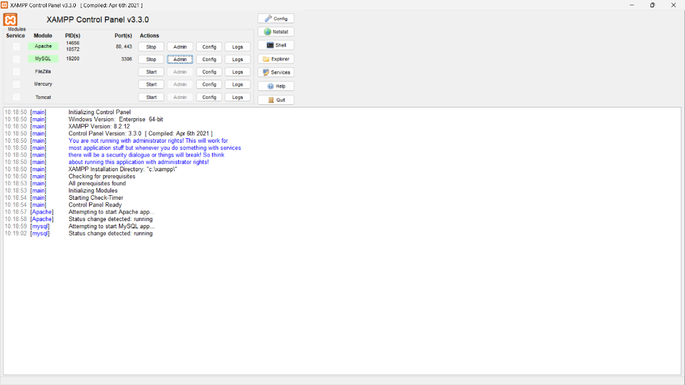
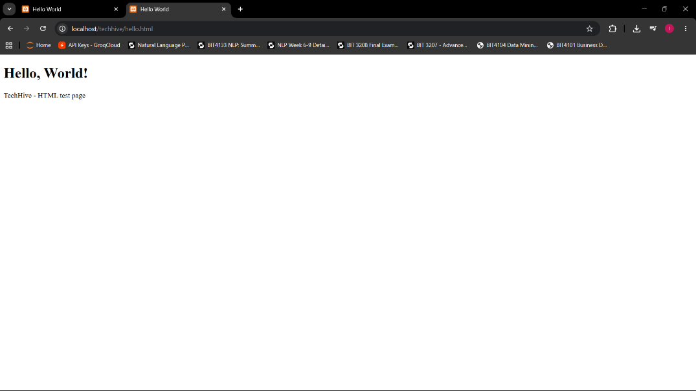
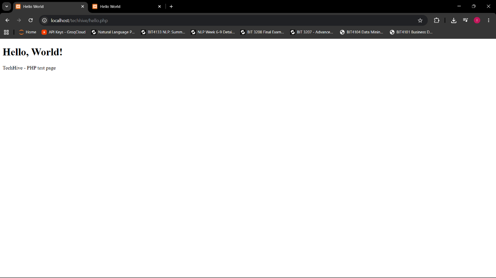
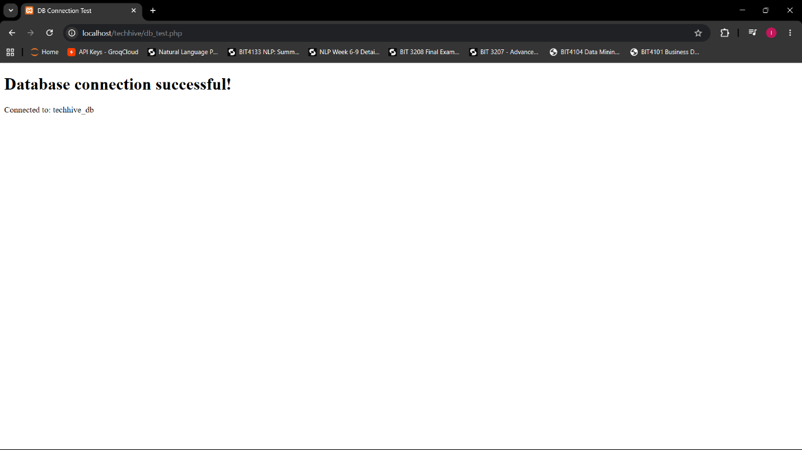

# Week 1 - Local Environment Setup

## What Was Done
- Installed XAMPP
- Tested localhost successfully
- Created Hello World HTML page
- Created Hello World PHP page
- Tested database connection (db_test.php)

## Files
- hello.html - Hello World HTML test page
- hello.php - Hello World PHP test page
- db_test.php - Database connection test
- Week1db.sql - Database export

## Screenshots

### Fig 1 – XAMPP Installation

### Fig 3 – Localhost Test Page (HTML)

### Fig 4 – Hello World PHP Page

### Fig 5 – Database Connection Test

