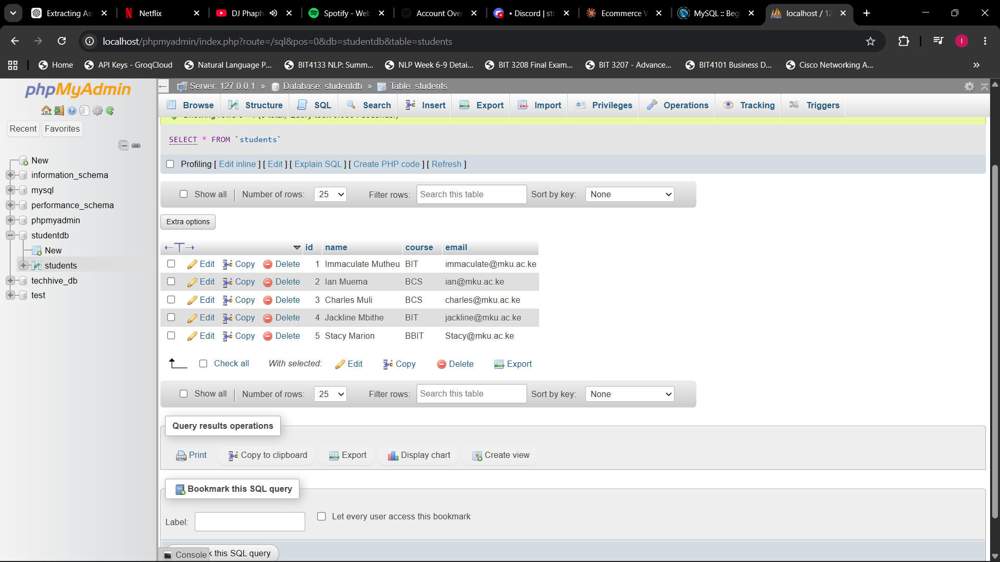
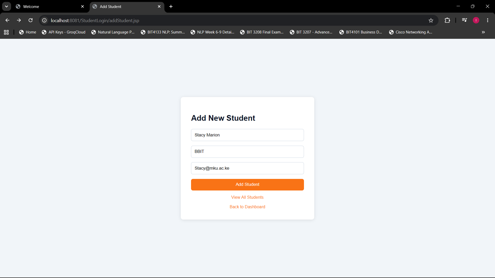
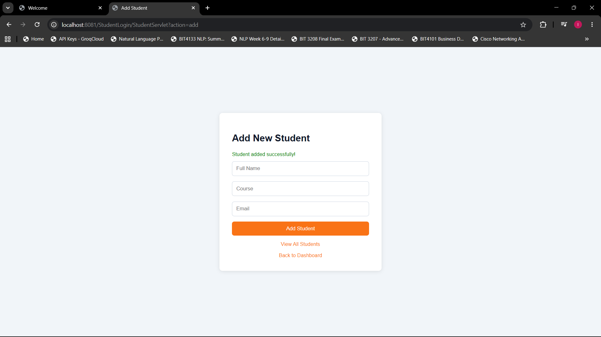
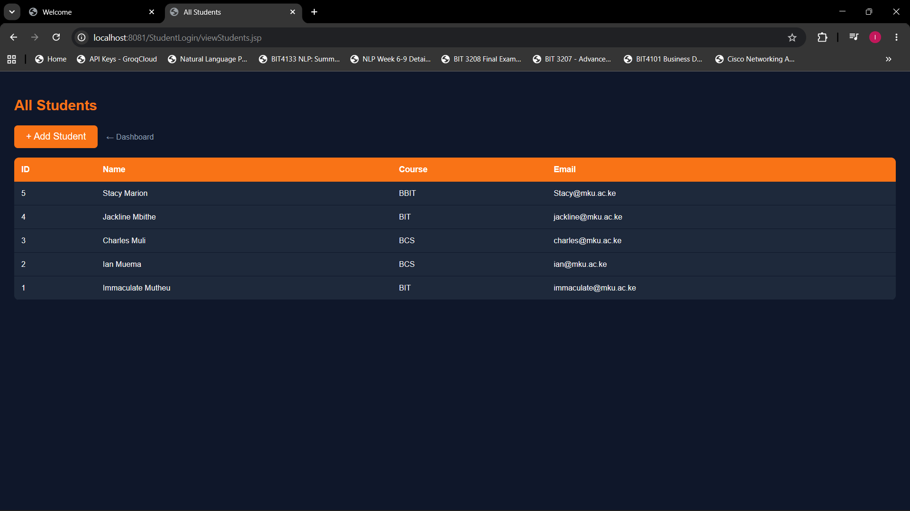
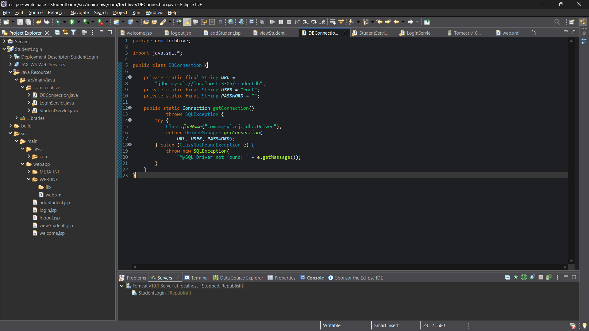

# Week 10 - Dynamic HTML Generation and JDBC Database Integration

**Environment:** Eclipse IDE + Apache Tomcat + Java + MySQL + JDBC

---

## Database Setup

CREATE DATABASE studentdb;

CREATE TABLE students (
    id INT PRIMARY KEY AUTO_INCREMENT,
    name VARCHAR(100),
    course VARCHAR(100),
    email VARCHAR(100)
);

---

## Fig 1 - Database Creation and Students Table in phpMyAdmin

studentdb created in phpMyAdmin showing the students table.

students table showing all records with id, name, course
and email columns.

---

## Fig 2 - Add Student Form

addStudent.jsp form for inserting new student records
into studentdb.

---

## Fig 3 - Student Added Successfully

Success message after student inserted using INSERT INTO
via JDBC PreparedStatement.

---

## Fig 4 - View All Students Dynamically

viewStudents.jsp fetching all records from studentdb
using SELECT query and displaying dynamically in JSP table.

---

## Fig 5 - DBConnection.java JDBC Code

DBConnection.java showing JDBC connection using
DriverManager.getConnection() with studentdb connection string.

---

## JDBC vs PHP Comparison

| Task | Java JDBC | PHP PDO |
|---|---|---|
| Connect to DB | DriverManager.getConnection() | new PDO() |
| Execute Query | PreparedStatement | prepare() |
| Retrieve Records | ResultSet | fetchAll() |
| Prevent SQL Injection | PreparedStatement | Prepared Statement |

---

## Reflection
Week 10 introduced dynamic HTML generation and JDBC database
connectivity. Fig 1 shows studentdb created in phpMyAdmin with
the students table and also shows the students table containing
sample records. Fig 2 shows the add student form. Fig 3 shows
the success message after a student is added using INSERT INTO.
Fig 4 shows all students fetched dynamically using SELECT and
displayed in a JSP table. Fig 5 shows DBConnection.java
establishing the JDBC connection using DriverManager.getConnection().
