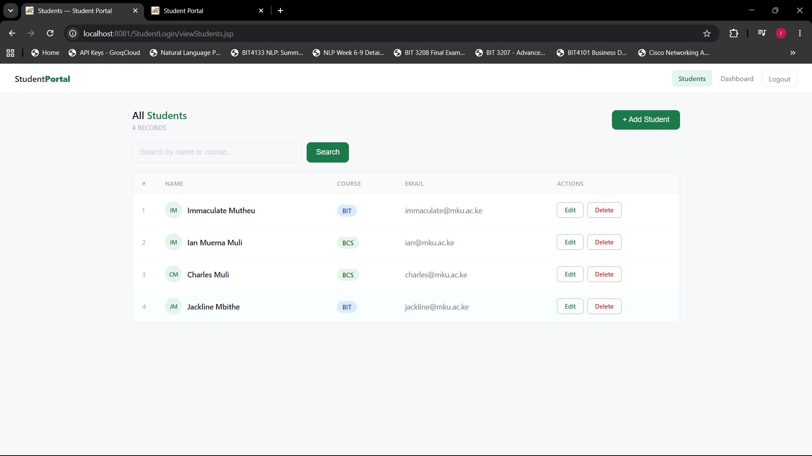
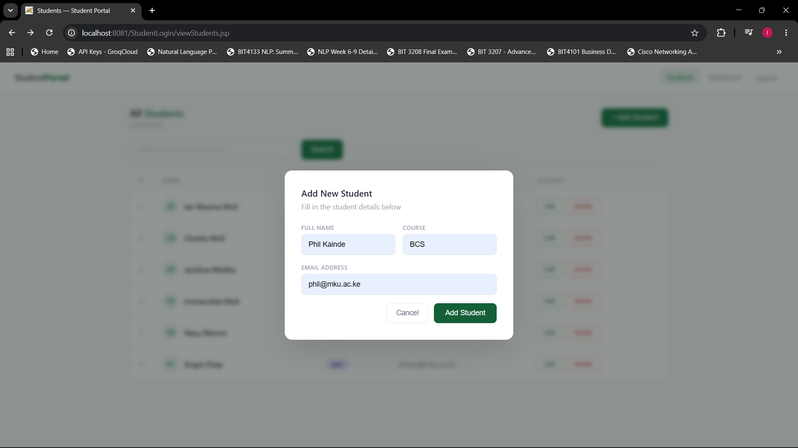
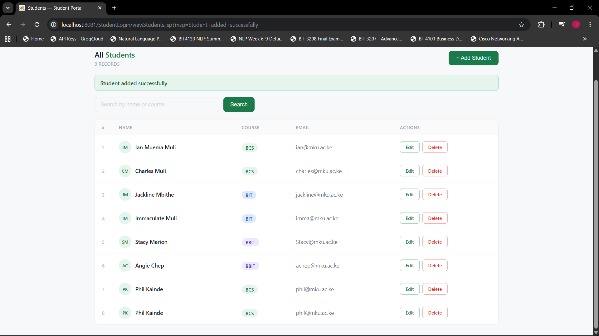
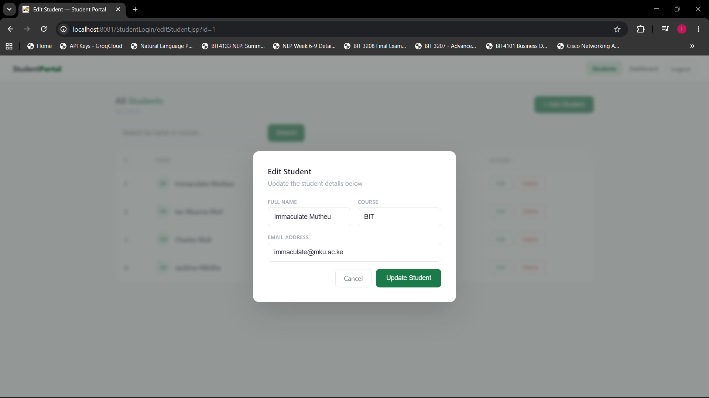
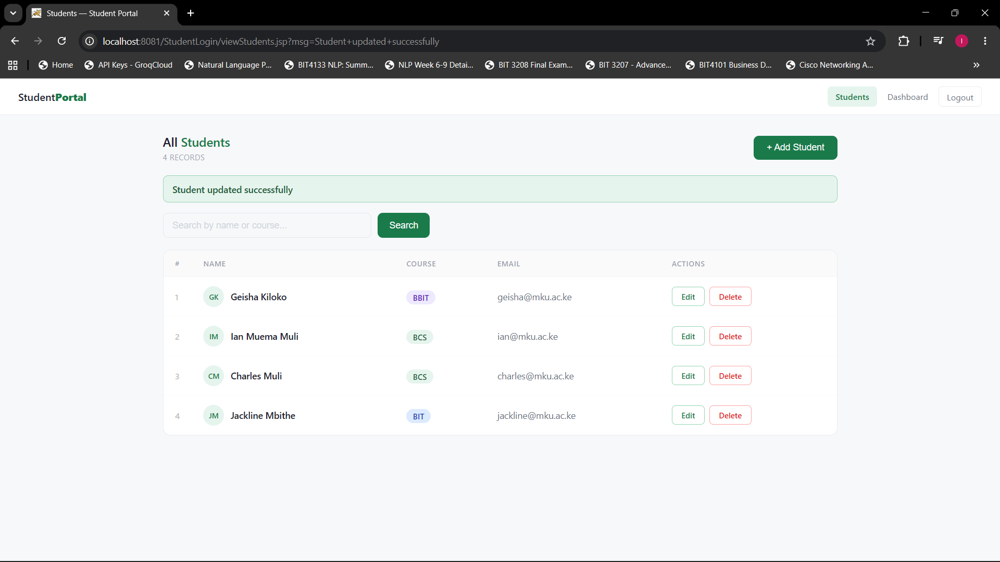
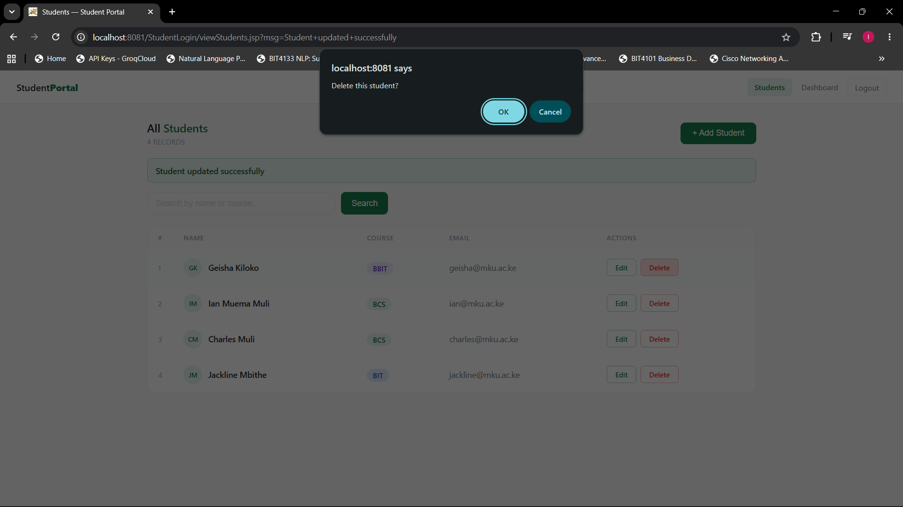
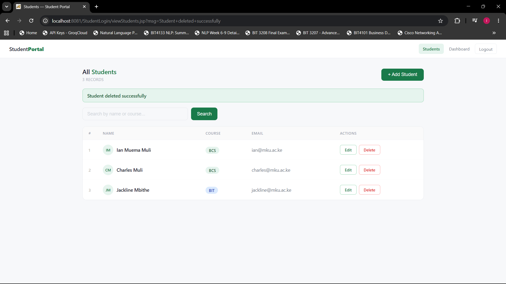
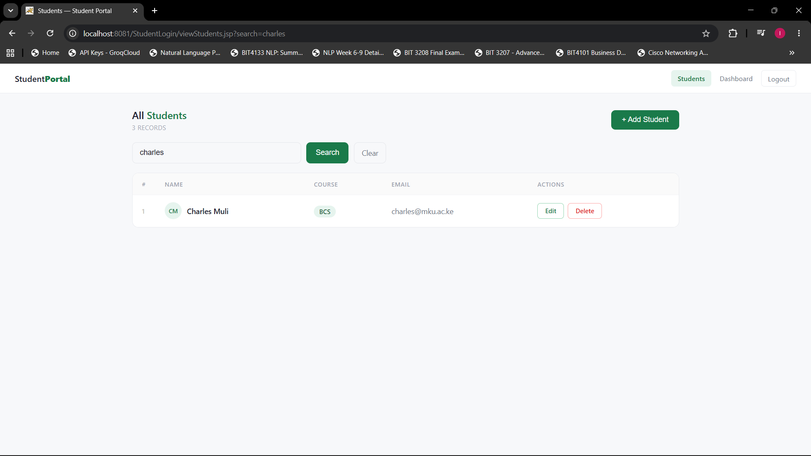

# Week 11 - Full CRUD Operations and UI Improvement

**Environment:** Eclipse IDE + Apache Tomcat + Java + MySQL + JDBC

## Features Implemented

### View All Students
## Fig 1 - All Students with CRUD Buttons

viewStudents.jsp fetches all records using SELECT ORDER BY id ASC
and displays them with row numbers, avatar initials generated
from student name, course badges colour coded by programme
and Edit/Delete action buttons per row.

### Add Student
## Fig 2 - Add Students 

Form opens as a modal popup over the blurred students table.
Submits via POST to StudentServlet which inserts using
INSERT INTO with PreparedStatement then redirects back
with a success message.

### Edit Student Details

## Fig 3 - Edit Student Modal

editStudent.jsp showing Edit Student modal pre-filled with
existing student data over a blurred students table background.
Clicking Edit opens editStudent.jsp which shows the students
table blurred in the background with an Edit Student modal
pre-filled with the student's existing data fetched by ID.

### Delete Student

## Fig 4 - Student Deleted Successfully

Success message after deleting a student using DELETE FROM
with WHERE clause targeting the student ID.
deleteStudent.jsp runs DELETE FROM students WHERE id=?
using a PreparedStatement then redirects back to the
students table with a success message.

### Search Student

## Fig 5 - Search Results

Search feature filtering students dynamically using
LIKE query on name and course columns.
Search bar filters students using LIKE query on name and
course columns - results update dynamically on the same page.

### UI Improvement
The entire interface was rebuilt with a clean light theme:
- Off-white background #f7f8fa
- Forest green #1a7a4a primary color
- White card panels with subtle borders
- Consistent navbar across all pages
- Avatar initials circle per student
- Colour coded course badges
- Modal popups with blurred backdrop
  
---

## Files
- DBConnection.java - JDBC connection class
- StudentServlet.java - handles Add and Edit POST requests
- viewStudents.jsp - displays all students with CRUD + Search
- editStudent.jsp - edit form as modal over blurred background
- deleteStudent.jsp - deletes student and redirects
- login.jsp - redesigned login page
- welcome.jsp - redesigned dashboard with stats cards

---

## Reflection
Week 11 extended the Student Management System with full CRUD
operations and an improved interface. Fig 1 shows the redesigned
student listing page with row numbers, avatar initials and course
badges. Fig 2 shows the Edit Student modal with student details
pre-filled over a blurred background. Fig 3 shows a successful
update, Fig 4 a successful deletion and Fig 5 the search feature
filtering students dynamically. The UI was rebuilt using a clean
light theme with a consistent green color system across all pages.
