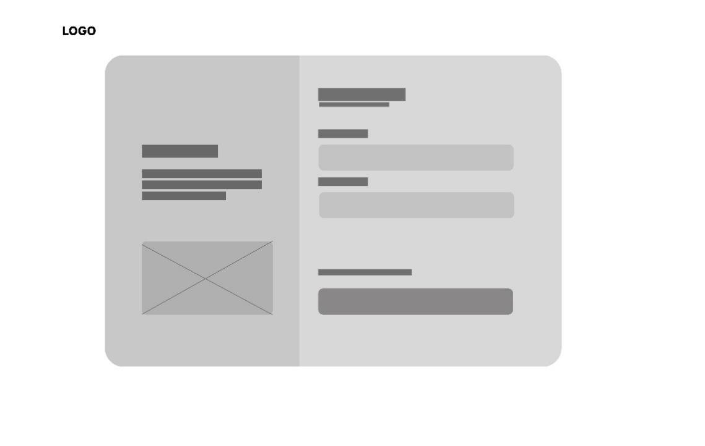
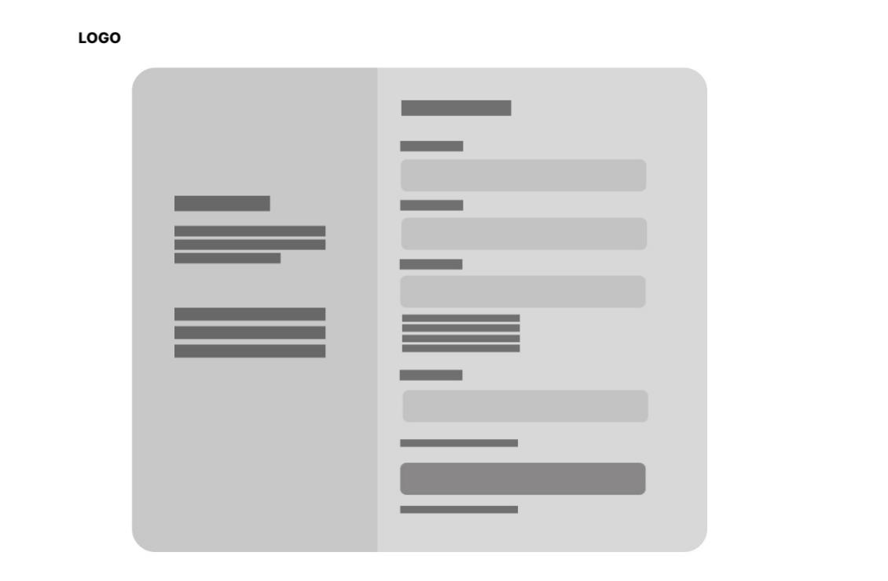
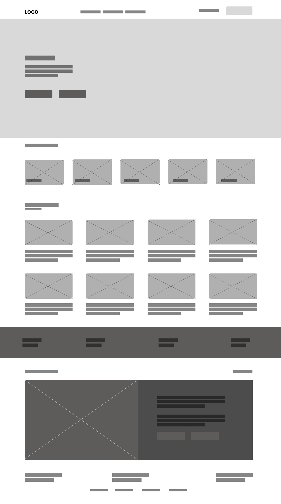
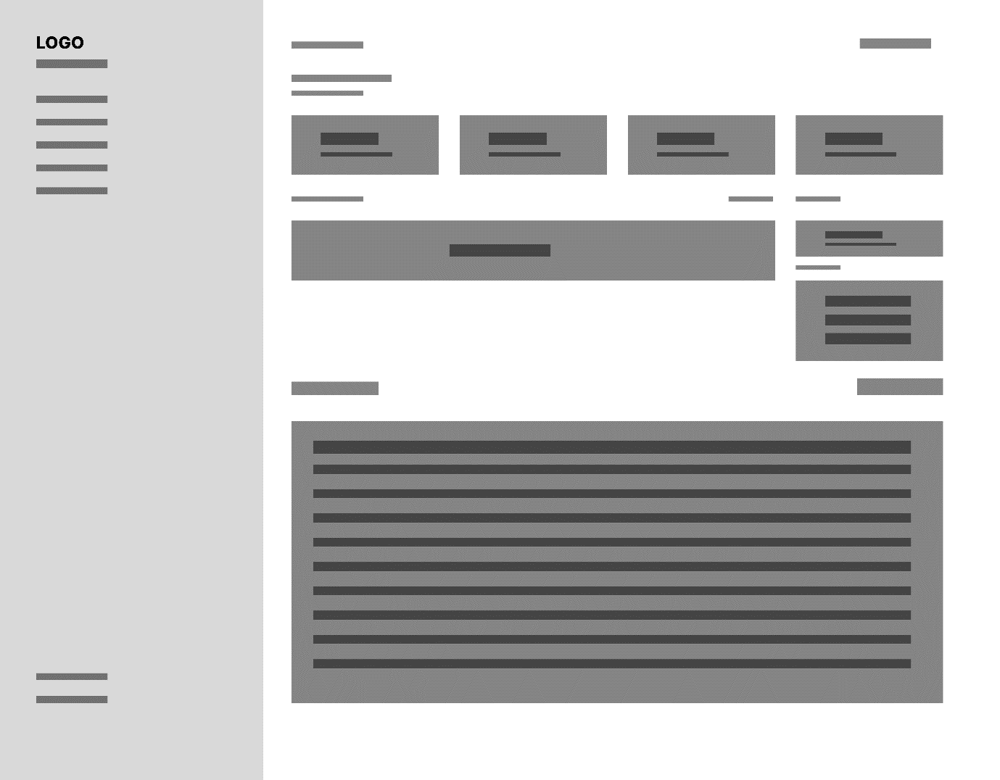
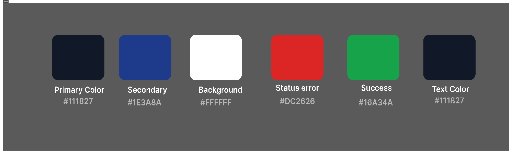
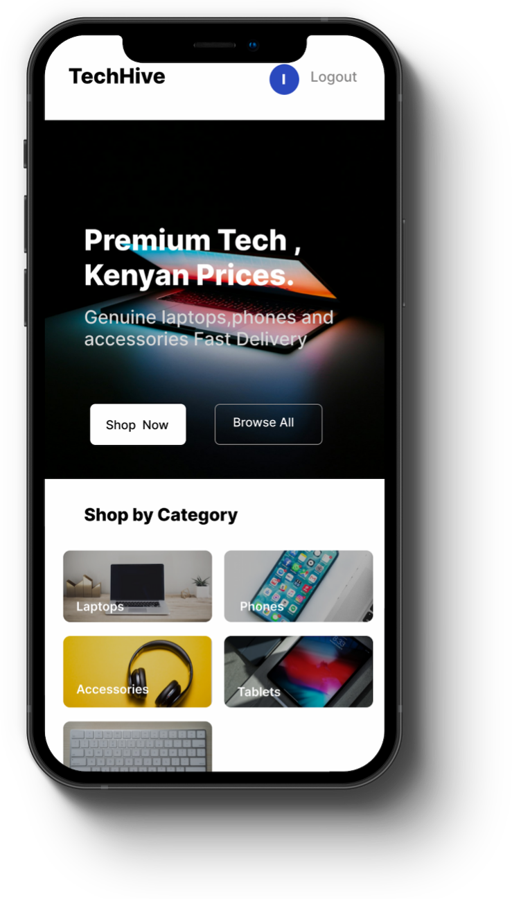
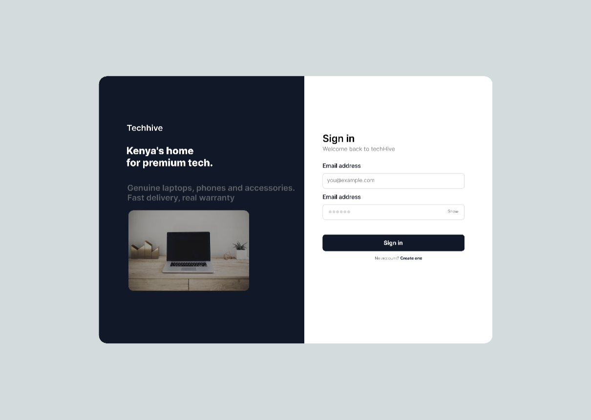
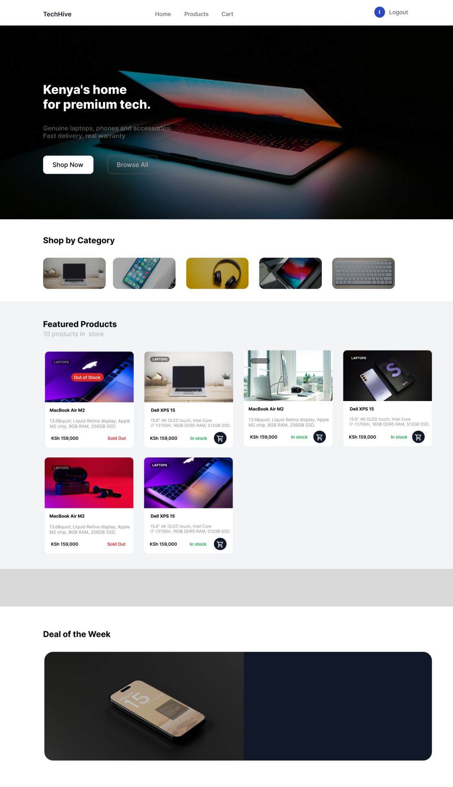
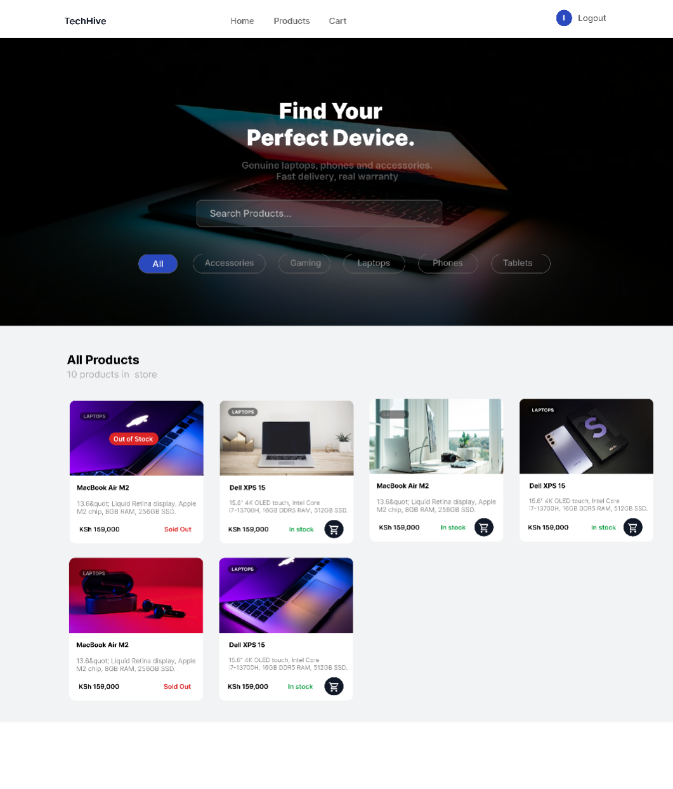
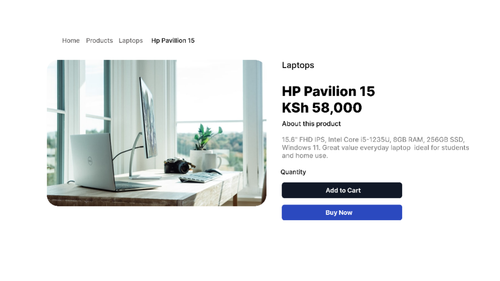

  # Week 2 - UI/UX and Design Foundations/Wireframes

## What i have 
- Homepage wireframe
- Login page wireframe
- Dashboard layout design
- Product page wireframe
- Mobile view mockup
- Color theme and navigation structure
- GUI prototype (Figma/Canva)

## Tools Used
- Figma

## Screenshots

### Fig 1 – Low-Fidelity Wireframes

| Wireframe | Screenshot |
|-----------|------------|
| 1.1 Sign In |  |
| 1.2 Sign Up |  |
| 1.3 Homepage |  |

### Fig 2 – Color Theme

### Fig 4 – Mobile View Mockup

### Fig 5 – GUI Prototype in Figma

| Screen | Screenshot |
|--------|------------|
| Sign In Page |  |
| Homepage UI |  |
| Products Page |  |
