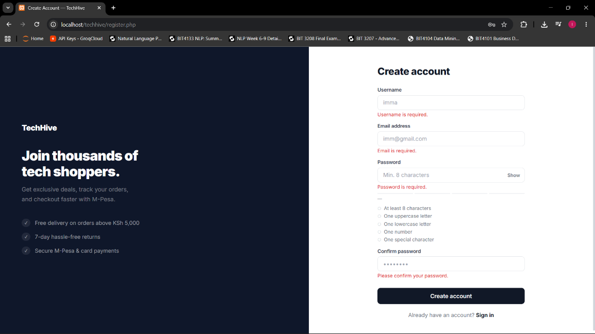
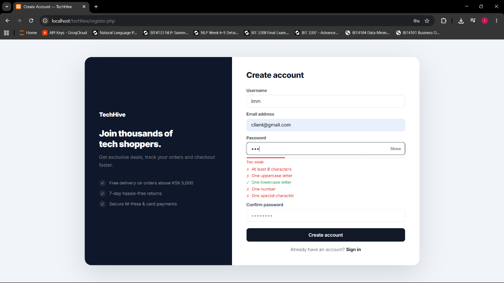
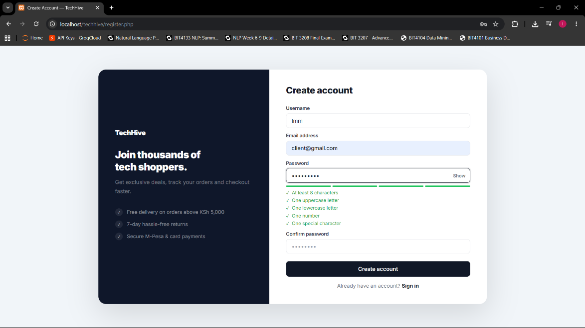
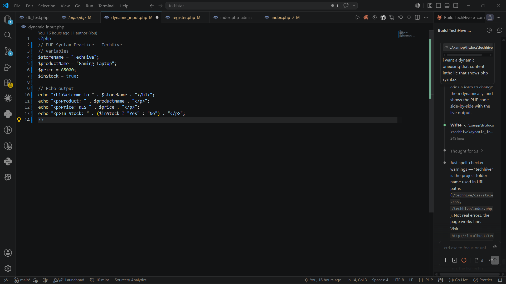
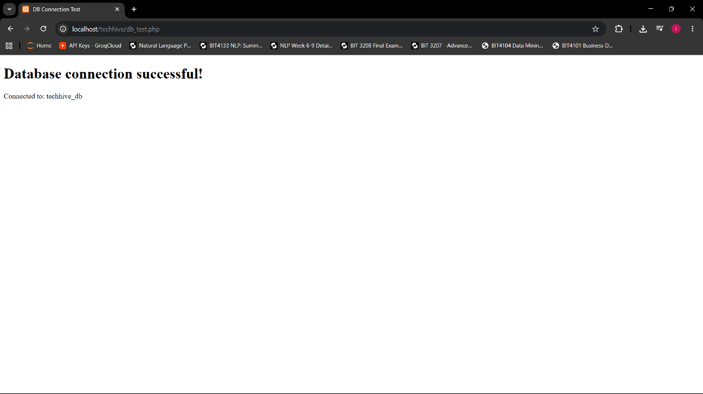
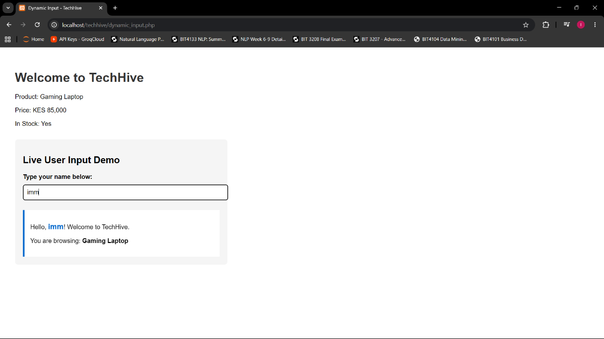

# Week 3 - JavaScript and PHP Basics

## Task 1 - JavaScript Basics
**File:** main.js, register.php  
Covered:
- Variables, functions, events, alerts
- Input handling
- Login form validation
- Email format validation
- Password strength checker (Weak / Medium / Strong)

## Task 2 - DOM Manipulation
**File:** dynamic_input.php  
Covered:
- Dynamic content changes
- Hide/show elements
- Button click handling

## Task 3 - Introduction to PHP
**Files:** register.php, login.php  
Covered:
- PHP syntax and variables
- Echo/output
- Form handling with $_POST
- PHP file structure

## Task 4 - Database Connection Practice
**File:** db_test.php  
Covered:
- PHP connected to MySQL
- Displays "Connected Successfully"
- Understanding of connection strings

## Screenshots

### Fig 1 – JavaScript Form Validation

### Fig 2 – Password Strength Checker

### Fig 2b – PHP Basics

### Fig 3 – PHP Syntax Practice

### Fig 4 – Database Connection Script

### Fig 5 – Dynamic User Input Handling

