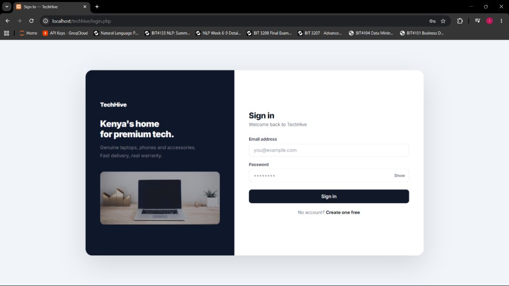
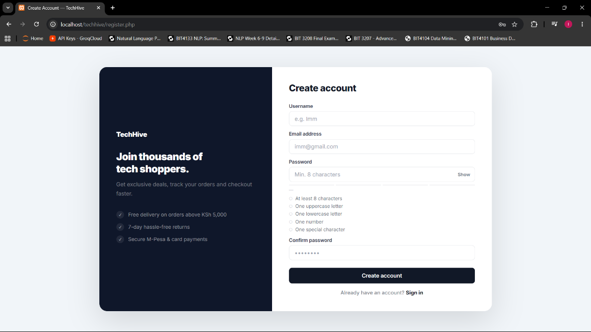
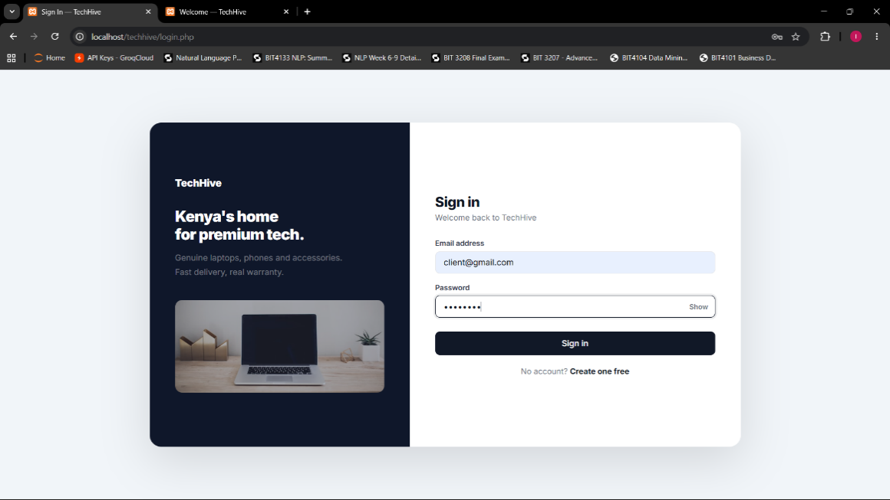
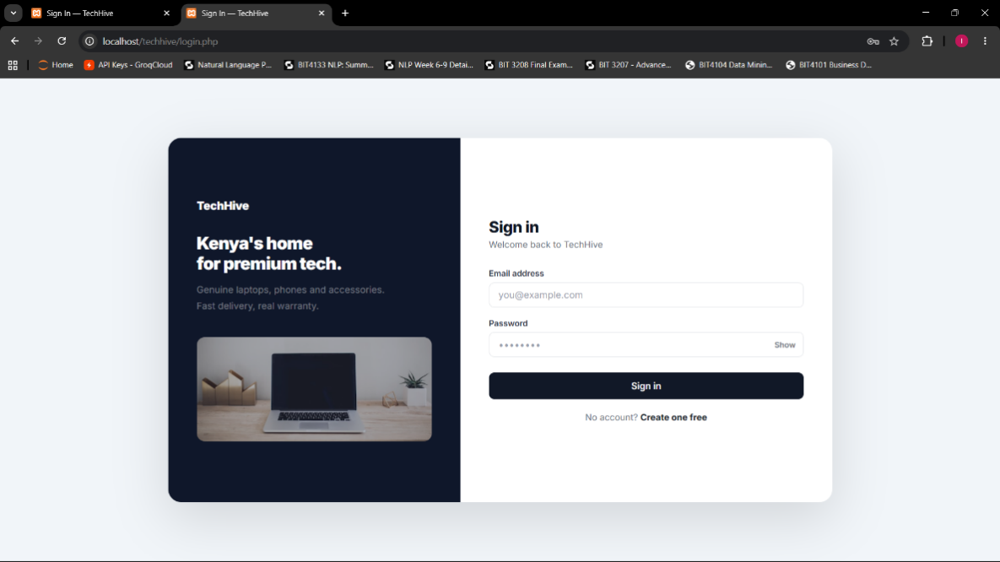
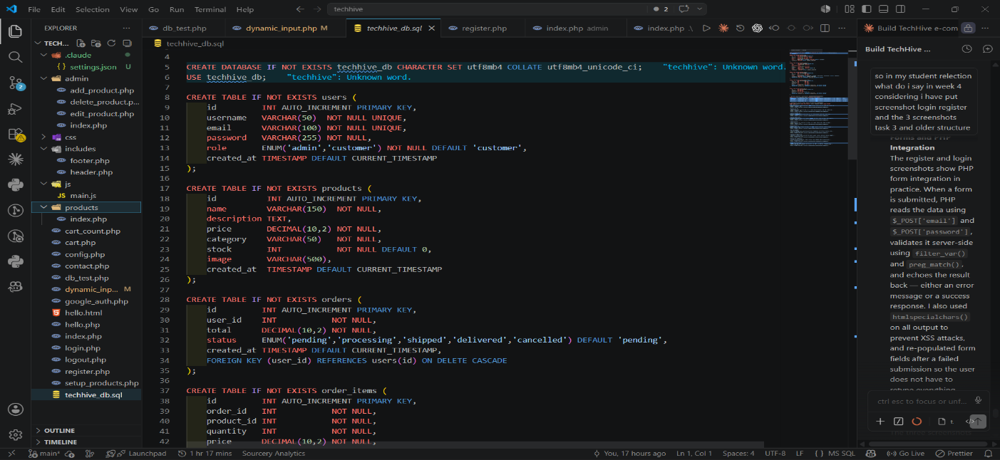

# Week 4 - Server-Side Components and Backend Development

## Task 1 - Server-Side Programming
**File:** dynamic_input.php
Covered:
- PHP processing form data using $_POST
- Dynamic welcome page showing submitted username
- Request-response cycle demonstrated
- Form submission system

## Task 2 - HTML Forms and PHP Integration
**Files:** register.php, login.php
Covered:
- POST and GET form methods
- Registration form with input processing
- Login form with secure data handling
- Input sanitization with htmlspecialchars()

## Task 3 - Simple Authentication System
**Files:** login.php, logout.php
Covered:
- Login logic with password_verify()
- Sessions started with session_start()
- Session-based welcome page after login
- Logout destroys session and redirects

## Task 4 - Backend Folder Organization
Professional structure implemented:
techhive/
├── index.php
├── login.php
├── register.php
├── logout.php
├── config.php
├── css/
├── js/
├── images/
├── includes/
│   ├── header.php
│   └── footer.php
└── admin/

## Task 5 - Modern Backend Alternatives
Stack comparison noted:
| PHP Concept | Modern Alternative |
|---|---|
| PHP Backend | Node.js |
| MySQL | MongoDB |
| PHP Sessions | JWT Authentication |
| XAMPP | Cloud Deployment |

## Screenshots

### Fig 1 – Login Form

### Fig 2 – Registration Form

### Fig 3 – Simple Authentication System

### Fig 4 – Backend Folder Structure

