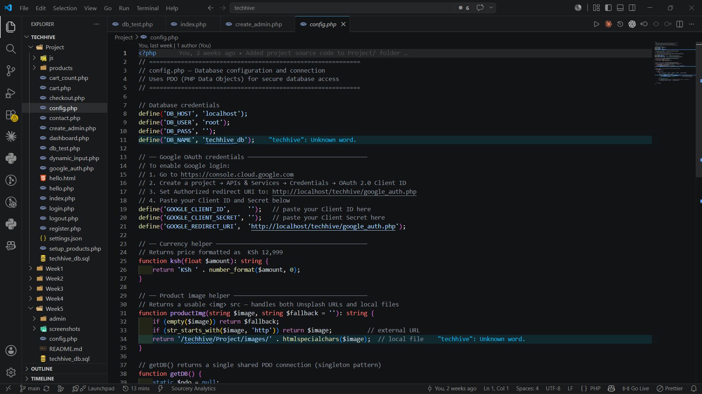
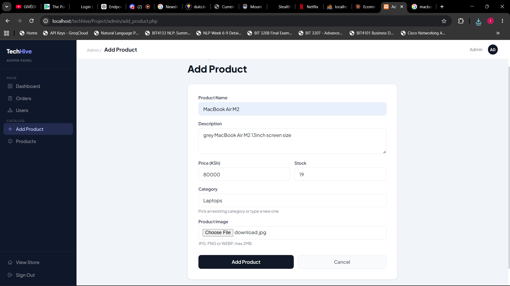
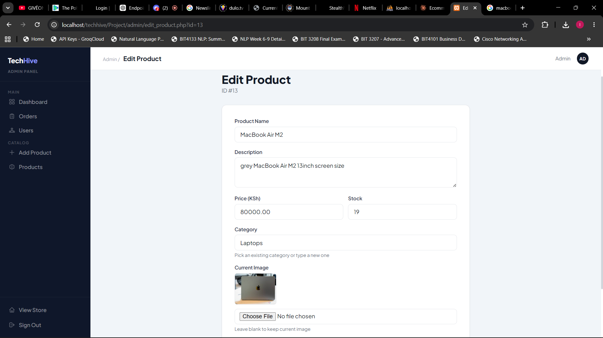
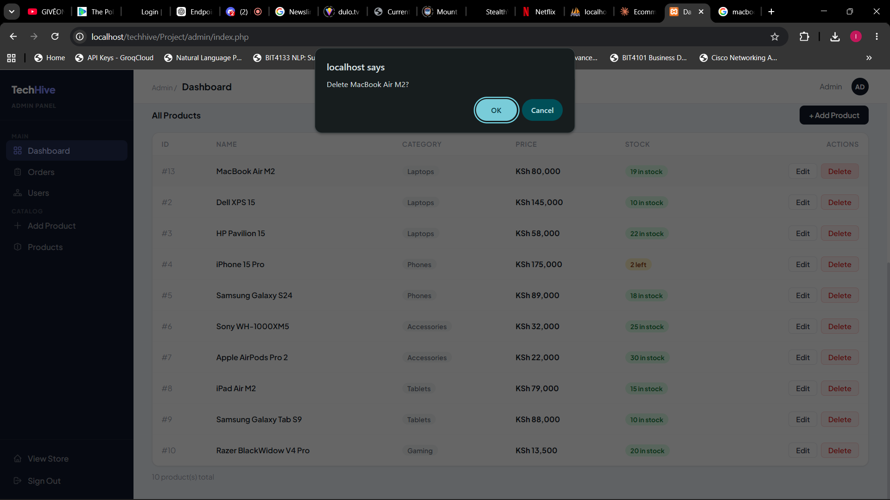

# Week 6 - Database Integration and CRUD Operations

## Task 1 - Database Creation
**File:** techhive_db.sql
Tables created:
- users (id, username, email, password, role, created_at)
- products (id, name, description, price, category, stock, image, created_at)
- orders (id, user_id, total, status, created_at)
- order_items (id, order_id, product_id, quantity, price)
- cart (id, user_id, product_id, quantity)
- Foreign keys (ON DELETE CASCADE) link users, orders, order_items, cart and products

## Task 2 - PHP to Database Connection
**File:** config.php
- PDO connection used (more secure than mysqli)
- Singleton getDB() function reuses one connection per request
- ATTR_ERRMODE set to ERRMODE_EXCEPTION for error handling
- ATTR_DEFAULT_FETCH_MODE set to FETCH_ASSOC
- ATTR_EMULATE_PREPARES set to false for real prepared statements
- Connection errors caught with try/catch

## Task 3 - CREATE Operation
**File:** admin/add_product.php
- Admin-only form for adding new products
- Validates name, price, category and stock before insert
- Handles optional product image upload (JPG/PNG/WEBP, max 2MB)
- Inserts product using a prepared statement:
  ```php
  $stmt = $db->prepare("INSERT INTO products (name, description, price, category, stock, image) VALUES (?, ?, ?, ?, ?, ?)");
  $stmt->execute([$name, $description, $price, $category, $stock, $imageFile]);
  ```

## Task 4 - READ Operation
**Files:** index.php, admin/index.php
- Homepage fetches all products and displays them in a product grid
- Admin panel lists all products in a management table with edit/delete actions
- Both pages pull live data from techhive_db via getDB()

## Task 5 - UPDATE Operation
**File:** admin/edit_product.php
- Loads existing product details into the edit form
- Validates submitted data the same way as the create form
- Optionally replaces the product image and deletes the old file
- Updates the record using a prepared statement:
  ```php
  $update = $db->prepare("UPDATE products SET name=?, description=?, price=?, category=?, stock=?, image=? WHERE id=?");
  $update->execute([$name, $description, $price, $category, $stock, $imageFile, $id]);
  ```

## Task 6 - DELETE Operation
**File:** admin/delete_product.php
- Reads the product id from the query string and casts it to an integer
- Removes the product record using a prepared statement:
  ```php
  $db->prepare("DELETE FROM products WHERE id = ?")->execute([$id]);
  ```
- Deletes the associated image file from disk
- Redirects back to the admin product list

## Screenshots

### Fig 1 – Database and Tables Created


### Fig 2 – PDO Database Connection (config.php)


### Fig 3 – CREATE: Adding a Product


### Fig 4 – READ: Products Displayed


### Fig 5 – UPDATE and DELETE: Editing and Removing a Product


