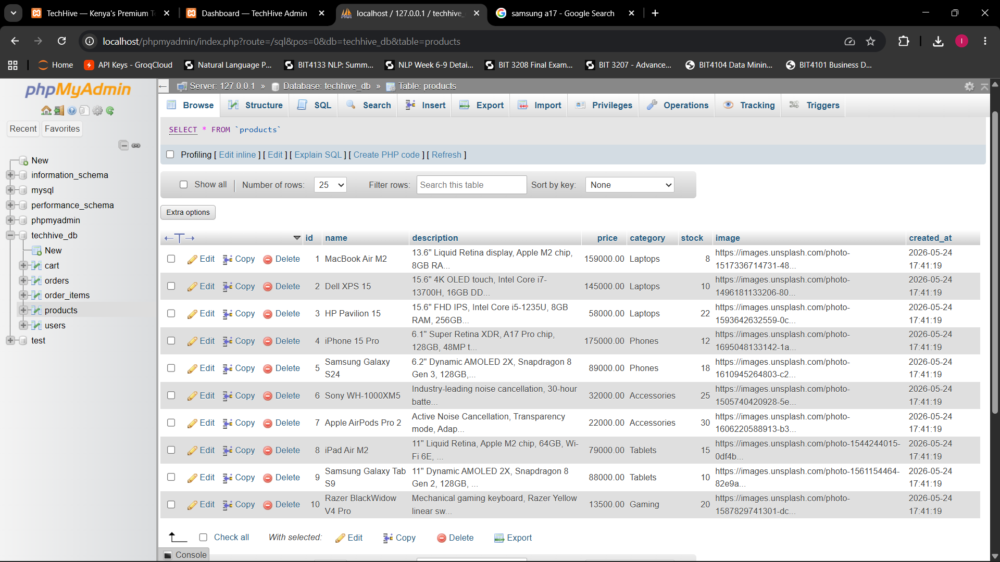

# Week 6 - Database Integration and CRUD Operations

## Learning Objectives Covered
- Designing and creating a relational database with related tables
- Connecting a PHP application to a MySQL database using PDO
- Implementing full CRUD (Create, Read, Update, Delete) operations
- Using prepared statements to prevent SQL injection
- Validating and sanitizing user input before database operations

## Task 1 - Database Creation
**File:** techhive_db.sql

The `techhive_db` database contains the following tables:
- **users** (id, username, email, password, role, created_at) — stores customer and admin accounts
- **products** (id, name, description, price, category, stock, image, created_at) — stores product catalog data
- **orders** (id, user_id, total, status, created_at) — stores customer orders, linked to `users`
- **order_items** (id, order_id, product_id, quantity, price) — line items linked to `orders` and `products`
- **cart** (id, user_id, product_id, quantity) — stores active shopping cart items, linked to `users` and `products`

Foreign key constraints (`ON DELETE CASCADE`) maintain referential integrity between users, orders, order_items, cart, and products.

## Task 2 - PHP to Database Connection
**File:** config.php

- Uses **PDO (PHP Data Objects)** to connect to MySQL, which is more secure and flexible than the older `mysqli` extension
- A `getDB()` function implements the **singleton pattern** — it creates one shared PDO connection and reuses it across the request, avoiding multiple open connections
- Connection options set:
  - `PDO::ATTR_ERRMODE => PDO::ERRMODE_EXCEPTION` — database errors throw exceptions instead of failing silently
  - `PDO::ATTR_DEFAULT_FETCH_MODE => PDO::FETCH_ASSOC` — query results returned as associative arrays
  - `PDO::ATTR_EMULATE_PREPARES => false` — uses real (server-side) prepared statements
- Connection errors are caught with `try/catch` and handled gracefully

## Task 3 - CREATE Operation
**File:** admin/add_product.php

- Admin-only page (checks `$_SESSION['role'] === 'admin'`) with a form for adding a new product
- Validates that name, price, category and stock are provided, and that price/stock are valid non-negative numbers
- Handles optional product image upload (JPG/PNG/WEBP, max 2MB) and stores the generated filename
- Inserts the new product using a parameterised query:
  ```php
  $stmt = $db->prepare("INSERT INTO products (name, description, price, category, stock, image) VALUES (?, ?, ?, ?, ?, ?)");
  $stmt->execute([$name, $description, $price, $category, $stock, $imageFile]);
  ```

## Task 4 - READ Operation
**Files:** index.php, admin/index.php

- The **homepage (index.php)** fetches all products from the `products` table and displays them in a dynamic product grid, including name, price, category and image
- The **admin panel (admin/index.php)** fetches and lists all products in a management table, showing the same data plus edit/delete controls for each row
- Both pages pull live data from `techhive_db` via `getDB()` — no hardcoded product data

## Task 5 - UPDATE Operation
**File:** admin/edit_product.php

- Loads the existing product by `id` using a prepared `SELECT` statement
- Pre-fills the edit form with the product's current details
- Validates the submitted data the same way as the Create form
- Optionally replaces the product image (deleting the old image file if a new one is uploaded)
- Updates the record using a parameterised query:
  ```php
  $update = $db->prepare("UPDATE products SET name=?, description=?, price=?, category=?, stock=?, image=? WHERE id=?");
  $update->execute([$name, $description, $price, $category, $stock, $imageFile, $id]);
  ```

## Task 6 - DELETE Operation
**File:** admin/delete_product.php

- Reads the product `id` from the query string and casts it to an integer
- Looks up the product's image filename before deletion
- Deletes the product record with a prepared statement:
  ```php
  $db->prepare("DELETE FROM products WHERE id = ?")->execute([$id]);
  ```
- Removes the associated image file from disk (if one exists) to keep storage in sync with the database
- Redirects back to the admin product list with a confirmation flag (`?deleted=1`)

## Security Implemented
- **PDO prepared statements** with bound parameters used for all CREATE, READ, UPDATE and DELETE queries — prevents SQL injection
- **Input validation** on the server side for required fields, numeric price/stock values, and non-negative values
- **Output escaping** with `htmlspecialchars()` when rendering user-supplied data back into HTML — prevents XSS
- **File upload restrictions** — only JPG/PNG/WEBP extensions accepted, with a 2MB size limit, and uploaded files renamed using `uniqid()` to avoid overwrites and path traversal
- **Access control** — admin pages check `$_SESSION['user_id']` and `$_SESSION['role'] === 'admin'` before allowing any CRUD action, redirecting unauthenticated users to the login page
- **Type casting** (`(int)`) on IDs read from the query string before use in queries

## Screenshots

### Fig 1 – Database and Tables Created


### Fig 2 – READ: Products Displayed


### Fig 3 – CREATE: Adding a Product


### Fig 4 – UPDATE: Editing a Product


### Fig 5 – DELETE: Removing a Product


## Reflection
This week tied together the database and application layers of TechHive. Building the CRUD operations for products reinforced how prepared statements protect against SQL injection while keeping code readable. The singleton `getDB()` pattern in config.php made it simple to reuse one connection across the admin panel and storefront. The hardest part was handling image uploads alongside the update operation, ensuring old files are cleaned up without breaking the product record if validation fails.

## Files
- `config.php` — PDO database connection and `getDB()` singleton
- `techhive_db.sql` — database schema and seed data (users, products, orders, order_items, cart)
- `admin/index.php` — admin panel listing products (READ) with links to CRUD actions
- `admin/add_product.php` — CREATE operation
- `admin/edit_product.php` — UPDATE operation
- `admin/delete_product.php` — DELETE operation
- `index.php` — READ operation, displays products on the homepage
