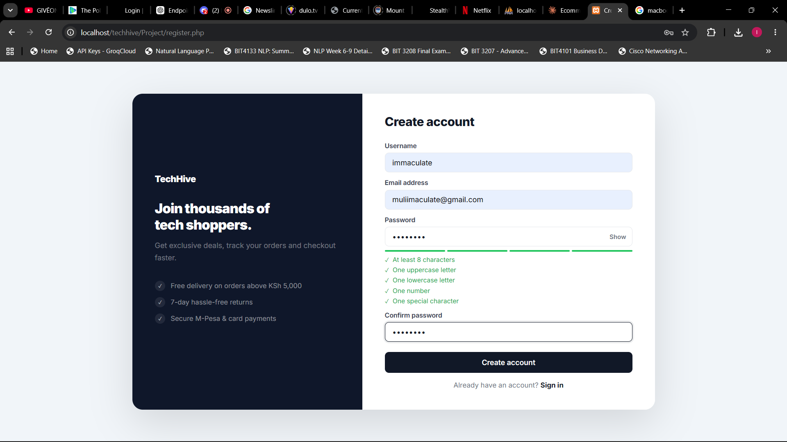
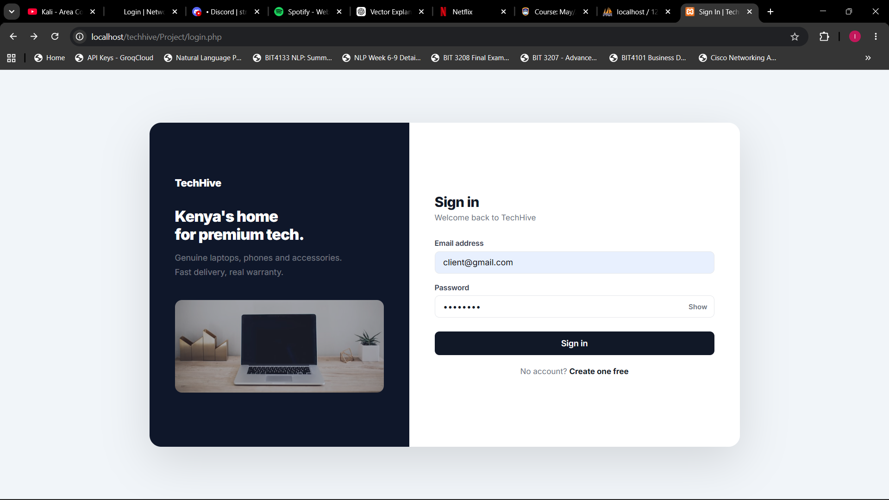
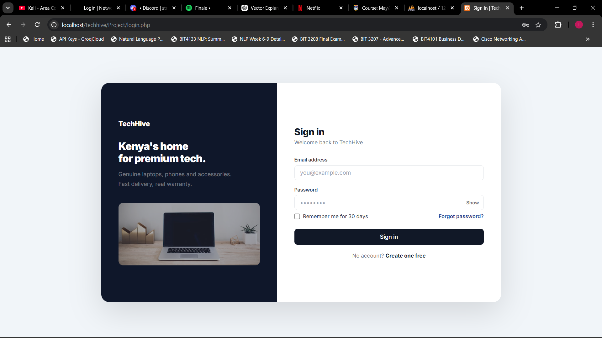
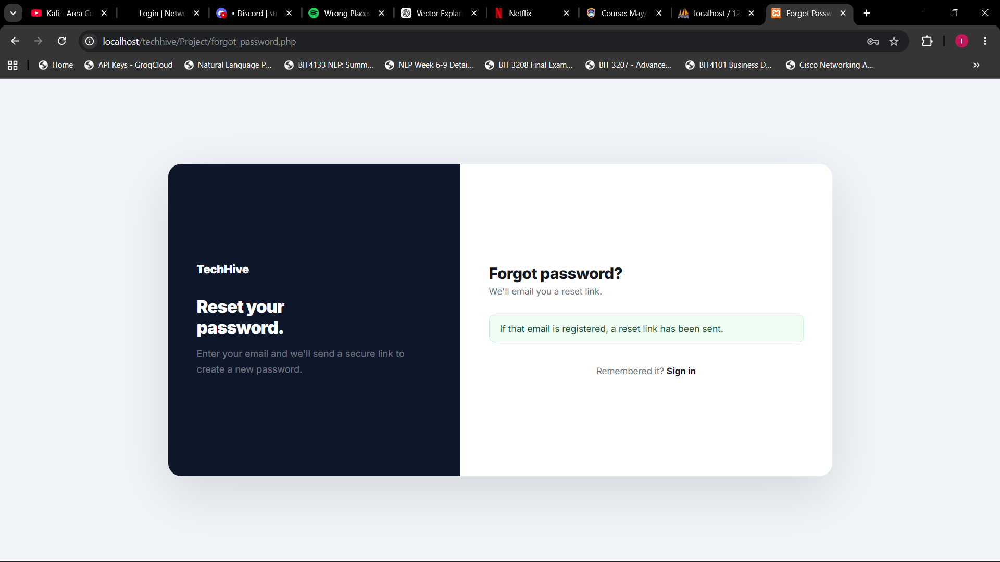
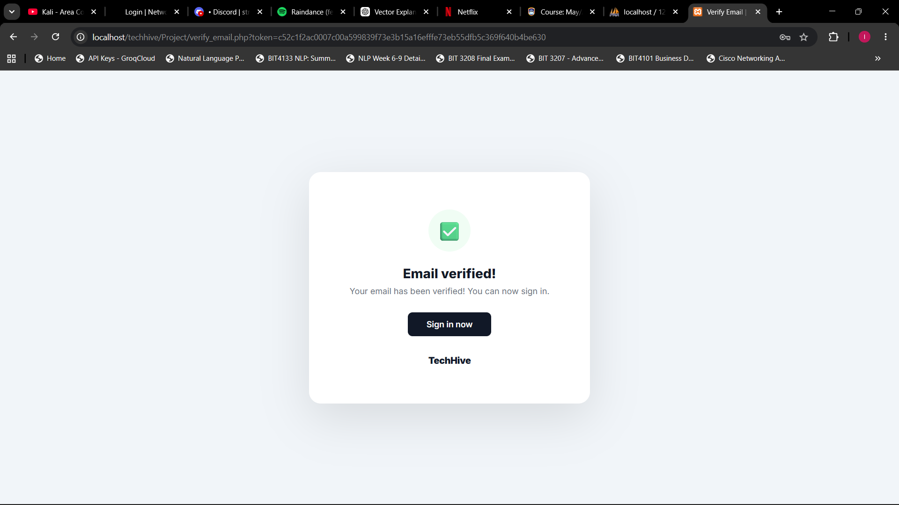
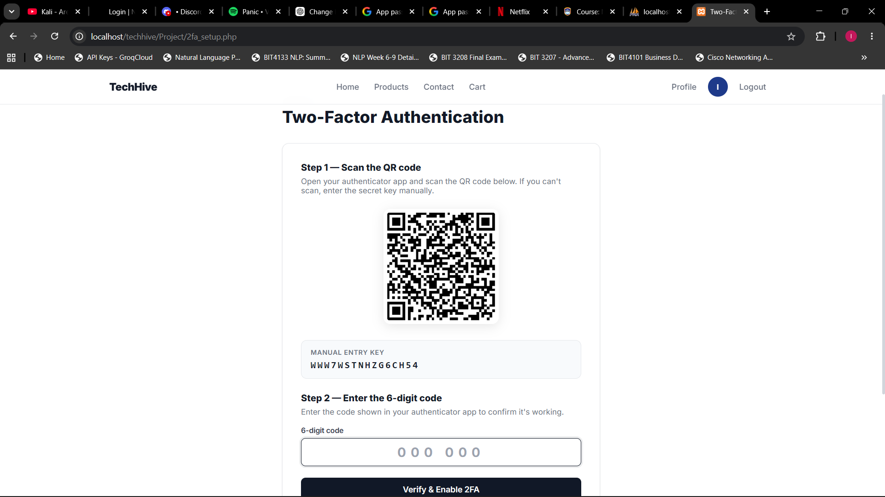
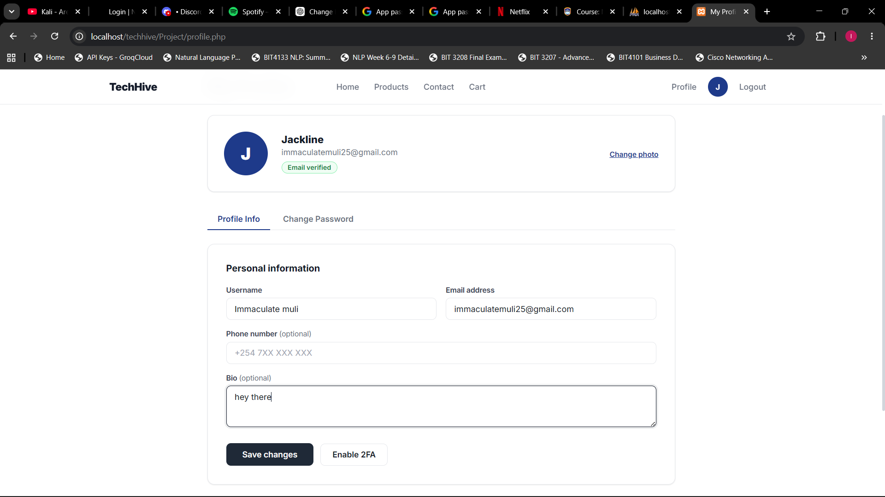

# Week 7 - User Authentication and Session Management

## Fig 1 — User Registration with Password Hashing

## Fig 2 — User Login

## Fig 3 — Session-Based Successful Login

## Fig 4 — Logout Functionality

---

## Bonus Features

### Bonus Fig 1 — Password Reset

### Bonus Fig 2 — Email Verification

### Bonus Fig 3 — Two-Factor Authentication (2FA)

### Bonus Fig 4 — User Profile Management

---

## Reflection
Week 7 built a complete authentication system for TechHive. Fig 1
shows register.php hashing passwords using password_hash() before
storing them in techhive_db. Fig 2 shows login.php verifying
credentials using password_verify() and creating a session on
success. Fig 3 shows the homepage displaying the logged-in username
from $_SESSION at the top. Fig 4 shows logout.php destroying the
session and redirecting to login, confirming the user is fully
signed out. As bonus features, TechHive also implements password
reset in case a user forgets their password, email verification on
registration, two-factor authentication requiring a one-time code,
and user profile management allowing customers to update their
account details.
