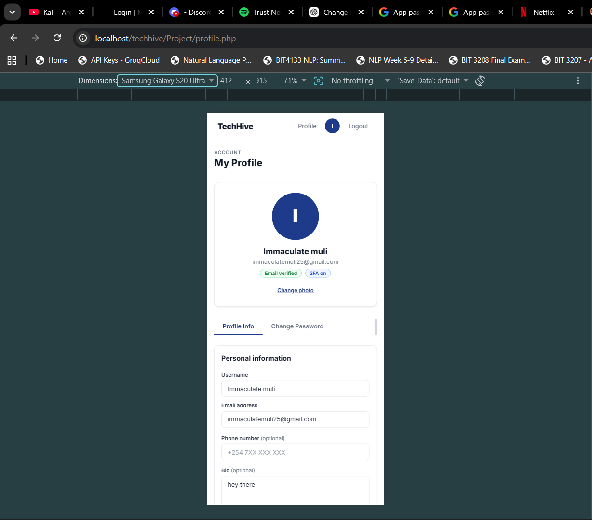
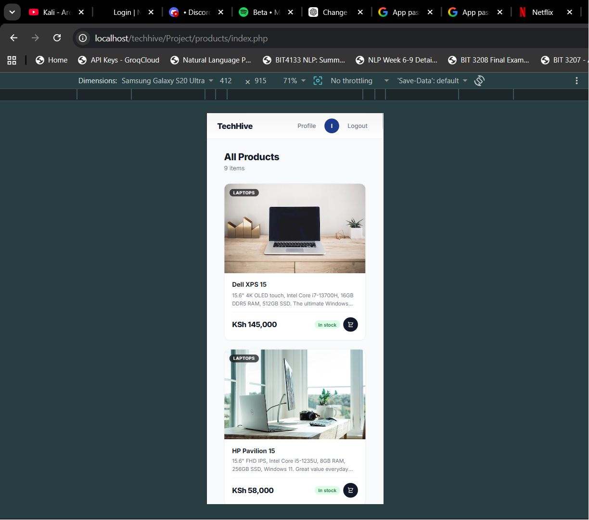
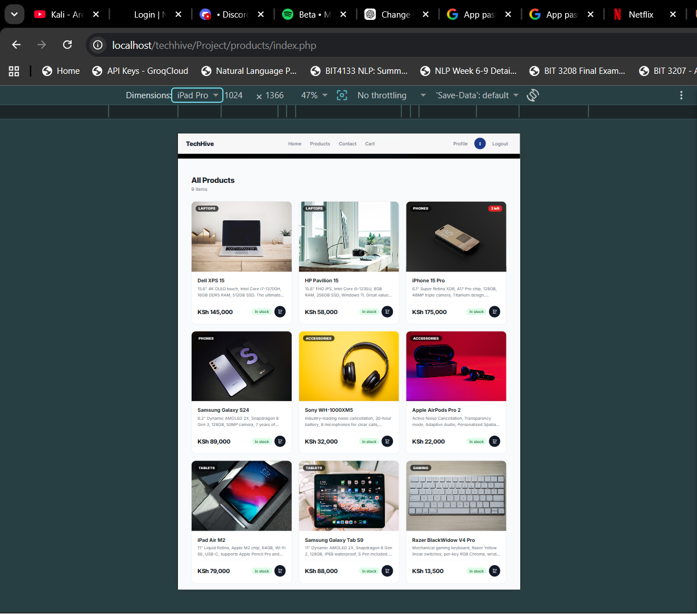
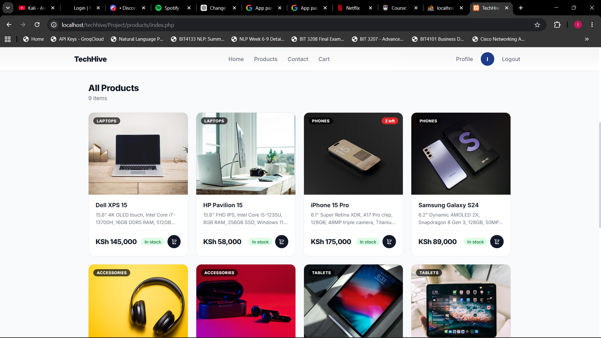

# Week 8 - Responsive Web Design and Mobile-First Development

## Fig 1 — Responsive Personal Profile Page

## Fig 2 — Responsive Product Showcase

### Fig 2.1 — Mobile View Display

### Fig 2.2 — Tablet View Display

### Fig 2.3 — Desktop View Display

## Reflection
Week 8 focused on Responsive Web Design and Mobile-First
Development. Fig 1 shows the responsive personal profile page
built using Flexbox.Fig 2.1 shows the mobile view displaying one product per row,
Fig 2.2 shows the tablet view displaying three products per row, 
and Fig 2.3 shows the desktop view displaying four products per row.
