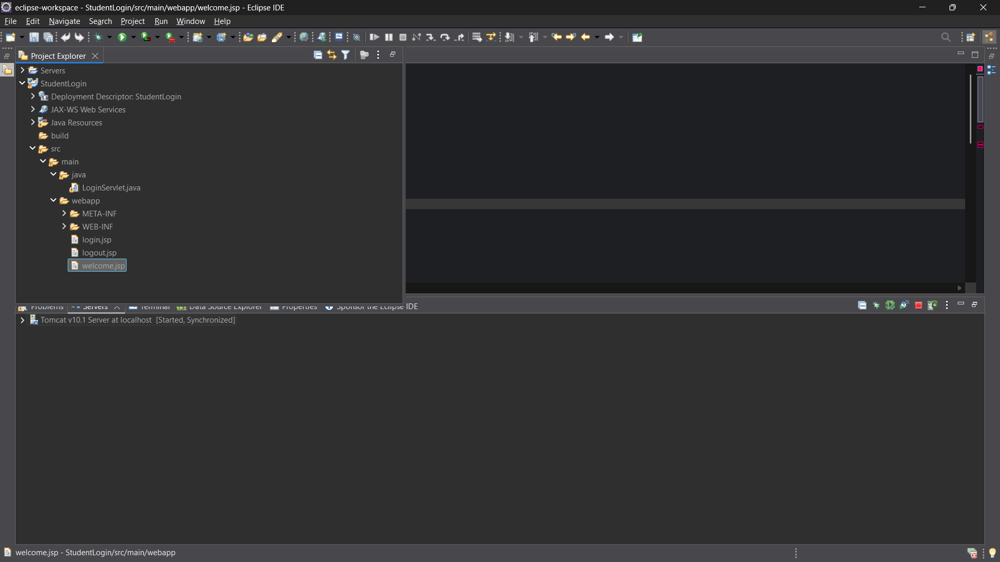
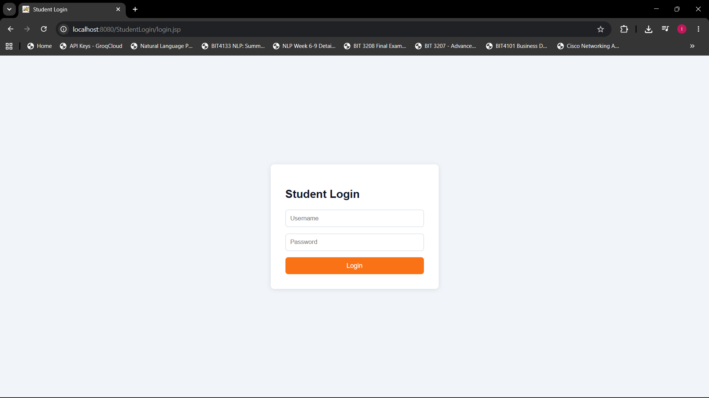
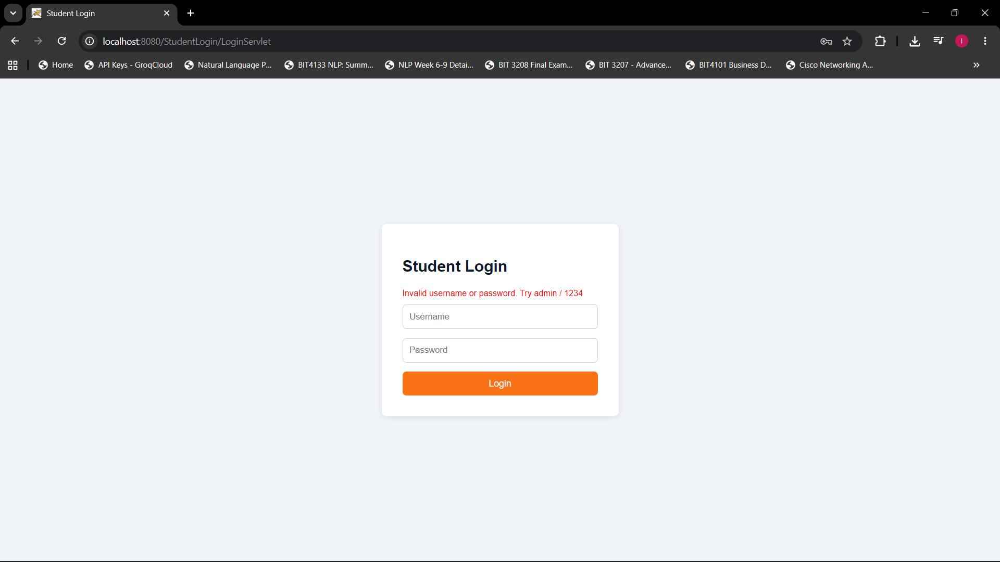
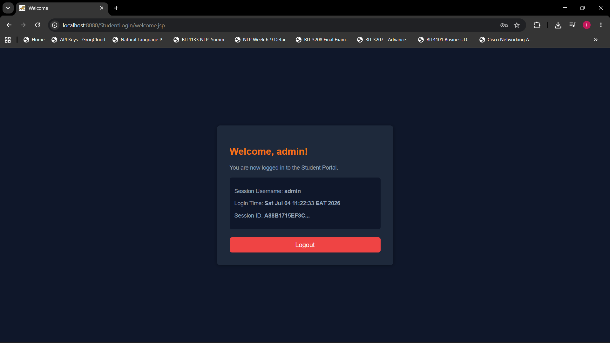
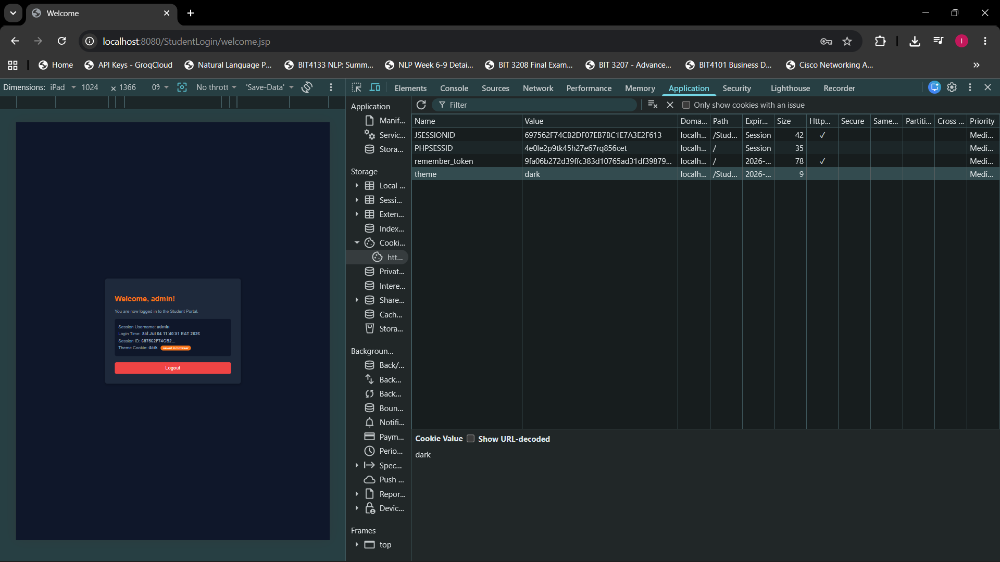
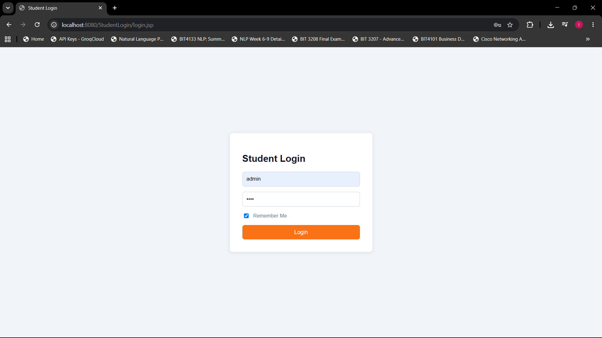
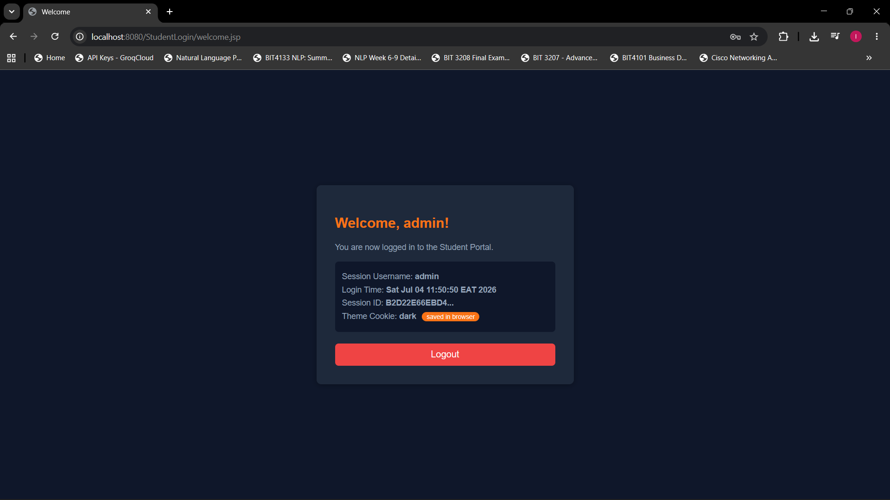

# Week 9 - Java Web Services, Servlet Lifecycle, Session Management and Cookies

**Status:** ✅ Done
**Environment:** Eclipse IDE + Apache Tomcat v10.1 + Java Servlets + JSP

---

## Fig 1 — Eclipse Project Structure

---

## Fig 2 — Login Page

---

## Fig 3 — Wrong Credentials Validation

---

## Fig 4 — Session ID and Login Time on Dashboard

---

## Fig 5 — Theme Cookie in Browser DevTools

---

## Fig 6 — Remember Me Cookie

---

## Fig 7 — Logout and Session Destruction

---

## Servlet Lifecycle
| Method | Purpose | Called |
|---|---|---|
| init() | Initialize resources | Once on startup |
| service() | Handle each request | Every request |
| destroy() | Release resources | Once on shutdown |

## Session vs Cookies
| Session | Cookies |
|---|---|
| Stored on server | Stored in browser |
| More secure | Less secure |
| Large storage | Small storage |
| Recommended for login | Recommended for preferences |

## Files
- LoginServlet.java — validates credentials, creates HttpSession, handles Remember Me cookie
- login.jsp — login form with Remember Me checkbox and cookie pre-fill
- welcome.jsp — protected page showing session username, login time, session ID and sets theme cookie
- logout.jsp — invalidates session and redirects to login

## Reflection
Week 9 introduced Java Web Services, Servlet lifecycle and 
session management using Eclipse IDE and Apache Tomcat. Fig 1 
shows the StudentLogin project structure containing the 
LoginServlet, login.jsp, welcome.jsp and logout.jsp files. 
Fig 2 shows the login page and Fig 3 demonstrates validation 
rejecting incorrect credentials. Fig 4 shows the welcome page 
displaying the username, session ID and login time retrieved 
from HttpSession. Fig 5 shows the theme cookie and Fig 6 shows 
the rememberedUser cookie stored in the browser confirming 
cookies persist across sessions. Fig 7 confirms session 
invalidation on logout redirecting back to login.jsp.